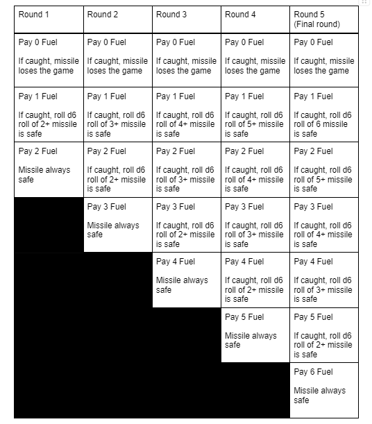

# Terminal Maneuver: A game of missile vs laser

In this game there are two players, a missile and a laser. The missile is flying toward the laser in the vacuum of space.

The missile's goal is to visit the laser. The laser goal is to shine light on the missile. However the missile is maneuvering to make it hard for the laser to predict its position. The missile wins if it finishes Round Five and reaches the laser. The laser wins if the missile loses.

Each turn each turn the missile chooses how much fuel to burn and the laser attempts to guess how much fuel the missile has spent.

## Rules

The game takes place on the board provided below.
The laser always has a hand of 7 cards.
The missile starts with 6 fuel.

### Each round

1. The laser starts the round by playing one of its seven cards face down. This is the laser's guess of how much fuel the missile will burn.
2. Then, the missile chooses how much fuel it will burn in that round and reduces its remaining fuel by that amount.
3. Once the missile has decided how much fuel it wants to spend, the laser flips over the card it played face down.
4. If the laser guesses correctly, the missile is caught. Then roll a d6, if appropriate to determine if the missile loses the game. If roll determines that the missile is not safe, the missile loses the game.
5. The laser then returns the played card to their hand and the next round starts.
6. If Round 5 has ended and the missile has not lost the game, the missile wins and the laser loses.

### Notes

- The missile can not have negative fuel. If the missile has 0 fuel it no longer has any options and must pay 0 fuel in all future rounds.
- The laser always has all seven cards in their hand.
- When we say”roll a d6 on a 4+ missile is safe, we need on a roll of 4, 5, or 6, the missile is safe” and all other outcomes the missile loses the game.
- It is pointless for the laser to ever guess squares in which the missile is always safe, as guessing correctly, i.e., catching the missile has no effect.

### Gameboard

